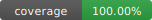

# Mailing Api 📧

[](https://github.com/agusnarvaez/mailing-api/actions)
[](#tests)
[](https://nodejs.org)
[](LICENSE)
[](https://mailing-api.fly.dev)
[](#deployment)

## Descripción

Este proyecto es un servicio de mailing propio.

## Tecnologías

- Node.js: V20.1.0
- Express: V4.18.2
- express-validator: V7.0.1
- AWS SES

## Instalación

1. Clonar el repositorio.
1. Instalar las dependencias.

```bash
npm install
```

1. Crear un archivo `.env` en la raíz del proyecto con las siguientes variables de entorno:

```bash
PORT=3000
CORS_ALLOWED_ORIGINS=https://pauladallochio.com.ar,https://www.pauladallochio.com.ar
AWS_ACCESS_KEY_ID=YOUR_AWS_ACCESS_KEY_ID
AWS_SECRET_ACCESS_KEY=YOUR_AWS_SECRET_ACCESS_KEY
AWS_REGION=YOUR_AWS_REGION
```

También se soportan las variables legacy `AWS_ACCESS_KEY`, `AWS_ACCESS_KEY_SECRET` y `AWS_ACCESS_KEY_REGION` por compatibilidad.

1. Iniciar el servidor.

```bash
npm start
```

1. Realizar una petición `POST` a la siguiente URL:

```bash
http://localhost:3000/mail/send
```

Con el siguiente body:

```json
{
  "from": "origen@dominio.com",
  "to": "destino@dominio.com",
  "subject": "Asunto",
  "message": "Version texto del mail",
  "html": "<p>Version HTML del mail</p>",
  "cc": "copia@dominio.com"
}
```

## Endpoints

- `POST /mail/send`
- `GET /health`

## Tests

La aplicación incluye una batería de tests de integración HTTP con Vitest y Supertest.

```bash
npm test
```

Para modo watch:

```bash
npm run test:watch
```

Para ejecutar cobertura (umbrales al 100% en líneas, ramas, funciones y statements):

```bash
npm run test:coverage
```

## Registro de cuentas

Para utilizar el servicio de mailing, es necesario registrar una cuenta en AWS y configurar el servicio de SES (Simple Email Service).

1. Crear una cuenta en AWS: [aws.amazon.com](https://aws.amazon.com/).
2. Configurar el servicio de SES: [docs.aws.amazon.com/ses/latest](https://docs.aws.amazon.com/ses/latest/).
3. Obtener las credenciales de acceso y la región.
4. Configurar las variables de entorno en el archivo `.env`.
5. Verificar remitentes o dominios en SES antes de enviar correos desde producción.

## Autor

- Agustín Narvaez
- [GitHub](https://github.com/agusnarvaez)
- [LinkedIn](https://www.linkedin.com/in/narvaezagustin/)

## Licencia

[MIT](https://choosealicense.com/licenses/mit/)
